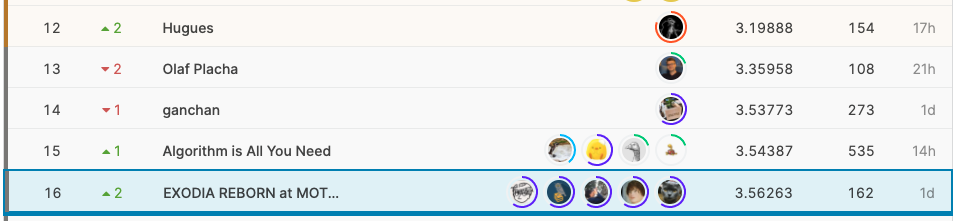

# Indoor

<div align="center"></div>
https://www.kaggle.com/c/indoor-location-navigation 


## logs
https://www.notion.so/Indoor-d96fb5ad316b4d1bbd5f6d9e37897c55

## result

16th/1170 (silver medal)
<div align="center"></div>


## solution

### Summary


---

### dataset
Our dataset is based on [indoor-unified-wifi-ds](https://www.kaggle.com/kokitanisaka/indoorunifiedwifids). The major differences are as follows.
- Remove the data, if the difference between timestamp of waypoint and last seen timestamp of wifi is more than 10s. **(This is very important)**
- The test data was also created as a wifi-based dataset in the same way as the train in order to average the timestamp during inference. So there are about three times as many lines as the original.
- The hidden waypoints are complemented by [Linear Interpolation](https://www.kaggle.com/kuto0633/linear-interpolation-for-waypoint-in-wifi-dataset) and [Kalman Filter](https://www.kaggle.com/arnaudcapitaine/get-indoor-location-by-means-of-kalman-smoother). This can be expected to have a padding effect on the data.


---
### model
#### model for xy
Our Model is based on [LSTM by Keras with Unified Wi-Fi Feats](https://www.kaggle.com/kokitanisaka/lstm-by-keras-with-unified-wi-fi-feats). Since this LSTM model is not time series based, we also use the MLP model. 
Using features is following.
- 80 pieces BSSID
- 80 pieces RSSI
- site id 
- floor (In inference, we use values which other model predict)

####  model for floor
- lightGBM (also try BiLSTM)
- Learning as a classification
- Create model in each site
- Create dataset each path file as one line
- StratifiedGroupKFold
- features
    - BSSID  
    - Mean RSSI
    - Max RSSI
    - Extract BSSIDs that are present in both test and train.


---
### training (2stage) 

#### 1st stage
- Almost as shown in the figure above.
- Custom loss
Each data in our dataset has timediff(time difference between timestamp of waypoint and timestamp of wifi group).  The larger this timediff is, the larger the discrepancy between the given target and the ground truth. So we apply Weighted-Loss according to timediff.

```python
# timediff -> weight
timediff = df['timediff'].astype(np.float32).abs().values
weight = 1- (timediff/np.max(timediff)) 

class WeightedMSELoss(nn.Module):
    def __init__(self):
        super().__init__()
        self.loss = nn.MSELoss(reduction='none')

    def forward(self, input, target, weight):
        input = input.float()
        target = target.float()
        weight = torch.stack((weight, weight), 1).float()  
        loss = self.loss(input, target) * weight 
        return loss.mean()
```

#### 2nd stage
Re-learn by adding the following elements.
- Add test data by pseudo labelig 
- Remove train data  if oof's error is over 40m (also try to remove over 20m)

---
### post processing (pp)

We use three-pp which were shared in Notebook & Discussion.
We repeated three-pp **6 times**. It is very effective.

- [Cost minimaization](https://www.kaggle.com/saitodevel01/indoor-post-processing-by-cost-minimization)
There are difference between delta by sensor and delta by target. So we corrected sensor delta by the coefficients which obtained by linear regression  in each site and each floor.

| | |
| --- | --- |
|  |   |
  
  
- [Snap to grid](https://www.kaggle.com/robikscube/indoor-navigation-snap-to-grid-post-processing)
We automatically generated 3 pattern extra grids instead of hand-labeling grids like following. 
  
| sparse | dense | edge |
| --- | --- | --- |
|  |  | 
   
   
- [device id leak](https://www.kaggle.com/iwatatakuya/use-leakage-considering-device-id-postprocess)

## ensemble
We did stacking and extra grid ensemble. We did post processing with 4 different patterns. Then, did ensemble by weighted average.

4 pattern is here.  
① snap to grid’s threshold=None / sparse extra grid  
② snap to grid’s threshold=None / dense  extra grid  
③ snap to grid’s threshold=None / edge  extra grid  
④ snap to grid’s threshold=5 / only train grid  

